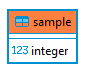

# Q0. Add the numbers (Database)
You are given some integers. Please find the **sum** and **avg** of them.

The following is the schema of the table.\

### Input (This file will NOT be provided in real questions, just for testing purpose)
testcase.sql

### Output Columns
1. sum
2. avg
#### Output
out.txt